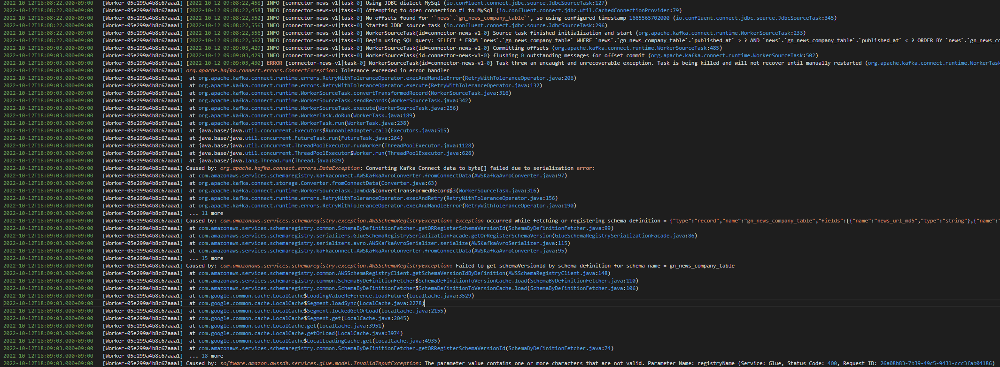
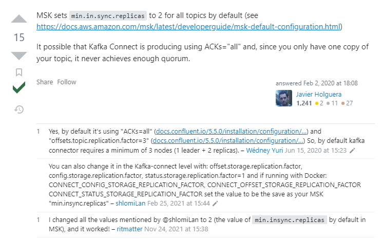

# kafak connector 설치

- 내용 추후 확인 필요 https://mongsil-jeong.tistory.com/35
- https://packages.confluent.io/archieve/6.1/ 


# custom connect plugin 등록

1. mysql connect download 
    - [실제 다운로드](https://www.confluent.io/hub/confluentinc/kafka-connect-jdbc?_ga=2.192985453.1155617456.1665478996-1952939441.1665478996&_gac=1.116139764.1665479176.CjwKCAjwqJSaBhBUEiwAg5W9p9igaKaW9KjosN05V7907wBqvgP-7D1rsk7wjecfkvZSLFNTYYr2XxoC-MMQAvD_BwE) 
    - (base) ubuntu@ip-10-0-2-115:~/download/confluentinc-kafka-connect-jdbc-10.6.0/lib$ pwd
/home/ubuntu/download/confluentinc-kafka-connect-jdbc-10.6.0/lib 아래와 같은 jar 파일 목록 확인
```bash 
checker-qual-3.5.0.jar          ons-19.7.0.0.jar        slf4j-api-1.7.36.jar
common-utils-6.0.0.jar          oraclepki-19.7.0.0.jar  sqlite-jdbc-3.25.2.jar
jtds-1.3.1.jar                  orai18n-19.7.0.0.jar    ucp-19.7.0.0.jar
kafka-connect-jdbc-10.6.0.jar   osdt_cert-19.7.0.0.jar  xdb-19.7.0.0.jar
mssql-jdbc-8.4.1.jre8.jar       osdt_core-19.7.0.0.jar  xmlparserv2-19.7.0.0.jar
ojdbc8-19.7.0.0.jar             postgresql-42.3.3.jar
ojdbc8-production-19.7.0.0.pom  simplefan-19.7.0.0.jar 
```
    - *실제 jar 파일만 모아둔 zip만 올려도 되는지 확인 필요*
    - 
2. (스키마레지스트리추가) 다운받아서 linux 상에서 schema-registry jar을 추가 하여 재 압축 필요 ( 전체 폴더 압축 )
   - git clone git@github.com:awslabs/aws-glue-schema-registry.git
   - cd aws-glue-schema-registry
   - mvn clean install
   - mvn dependency:copy-dependencies

3. aws-schema-registry / mysql-connector 두개에서 필요 jar 다운로드 
    - aws s3 cp s3://aicel-workflow/prod/kafka/confluentinc-kafka-connect-jdbc-10.6.0.zip .
4. aws-schema-registry / mysql-connector-java-8.0.11 / avro-kafkaconnect-converter ( maven project 중 확인 ) - 해당 jar 파일을 모아서 압축 
5. upload s3 
   - 압축된 zip 파일을 s3 업로드 
6. create msk custom plugin 
   - plugin 생성 

# Glue Schema Registry 등록

- schema registry > schema 등록
- avro schema
  
```json
{
    "type":"record",
    "name":"gn_news_company_table",
    "namspace":"news.naver.gn_news_company_table",
    "fields":[
        {
            "name":"news_url_md5",
            "type":"string"
        },
        {
            "name":"company_code",
            "type":"string"
        },
        {
            "name":"relavance",
            "type":"long"
        },
        {
            "name":"ncc_flag",
            "type":"string"
        },
        {
            "name":"published_at",
            "type":{
                "type": "int",
                "logicalType": "date"
            }
        },
        {
            "name":"use_flag",
            "type":"string"
        }
    ]
}
```

## worker configurations 설정

- 스키마 레지스트리를 사용 할 경우 ( value 만 사용 )
- schemaAutoRegistrationEnabled:true 설정 시 스키마를 자동으로 읽어서 생성 ( mysql의 db.schema.table 형태로 schema 생성 )

```conf
key.converter=org.apache.kafka.connect.storage.StringConverter
key.converter.schemas.enable=False
value.converter.region=ap-northeast-2
value.converter=com.amazonaws.services.schemaregistry.kafkaconnect.AWSKafkaAvroConverter
value.converter.schemas.enable=True
value.converter.schemaAutoRegistrationEnabled=True
value.converter.registry.name=aicel-news-gsr-prod
value.converter.schemaName=gn_news_company_table
value.converter.avroRecordType=GENERIC_RECORD
```

```conf
# not work
key.converter=org.apache.kafka.connect.storage.StringConverter
key.converter.schemas.enable=False
value.converter.region=ap-northeast-2
value.converter=com.amazonaws.services.schemaregistry.kafkaconnect.AWSKafkaAvroConverter
value.converter.schemas.enable=True
value.converter.schemaAutoRegistrationEnabled=true
value.converter.registry.name=news.naver  
value.converter.schemaName=gn_news_company_table
value.converter.avroRecordType=GENERIC_RECORD
```

- worker configuration 조회
  
```py
import boto3
from pprint import pprint 
import base64

pd.set_option('max_colwidth', None)

connect_clinet = boto3.client('kafkaconnect', region_name='ap-northeast-2')
response = connect_clinet.list_worker_configurations()

# pprint(response['workerConfigurations'])
df_worker_configurations = pd.DataFrame(response['workerConfigurations'])

df_desc = pd.DataFrame()
for idx, row in df_worker_configurations.iterrows():
    # print(row['workerConfigurationArn'])
    
    desc_response = connect_clinet.describe_worker_configuration(
        workerConfigurationArn=row['workerConfigurationArn']
    )
    
    # pprint(desc_response)
    
    df_desc.loc[idx, ['name']] = row['name']
    df_desc.loc[idx, ['content']] = base64.b64decode(desc_response['latestRevision']['propertiesFileContent'] ).decode("utf-8").replace('\r\n', '\n')
    
    print(f"***** {row['name']} *****")
    print( base64.b64decode(desc_response['latestRevision']['propertiesFileContent'] ).decode("utf-8").replace('\r\n', '\n'))

# display(df_desc)    
```

## source connector 생성

1. connector configuration
   - A connector configuration is a set of key-value mappings
   - 아래 설정 사용

### 설정값

- connector.class : 커넥터 종류(JdbcSourceConnector 사용)
- connection.url : jdbc이므로 DB의 정보 입력
- connection.user : DB 유저 정보
- connection.password : DB 패스워드
- mode : "테이블에 데이터가 추가됐을 때 데이터를 polling 하는 방식"(bulk, incrementing, - timestamp, timestamp+incrementing)
- incrementing.column.name : incrementing mode일 때 자동 증가 column 이름
- table.whitelist : 데이터를 변경을 감지할 table 이름
- topic.prefix : kafka 토픽에 저장될 이름 형식 지정 위 같은경우 whitelist를 뒤에 붙여 example_topic_users에 데이터가 들어감
- tasks.max : 커넥터에 대한 작업자 수(본문 인용.. 자세한 설명을 찾지 못함)

```conf
tasks.max=1
connector.class=io.confluent.connect.jdbc.JdbcSourceConnector
connection.url=jdbc:mysql://fngo-ml-rds-cluster-8-cluster.cluster-c6btgg8fszdb.ap-northeast-2.rds.amazonaws.com:3306/news?verifyServerCertificate=false&useSSL=false
connection.user=fngoMLAdmin
connection.password=fngo_2020-for!Knowledge
topic.prefix=news.
poll.interval.ms=10000
table.whitelist=gn_news_company_table
mode=timestamp
timestamp.column.name=published_at
timestamp.initial=-1
time.precision.mode=connect
```

- prefix를 지정하고 table 명이 뒤에 붙는 방식이지만 실제 topic 자체는 자동 생성은 하지 않음.
- timestamp.initial -1 현재 시점 부터
- topic 설정시 추가 참고
- topic.regex=news.naver*


## sink connector

```conf

```

## TEMP

- [참고](https://cjw-awdsd.tistory.com/53)

```json 
{
    "name": "my-source-connect",
    "config": {
        "connector.class": "io.confluent.connect.jdbc.JdbcSourceConnector",
        "connection.url": "jdbc:mysql://localhost:3306/test",
        "connection.user":"root",
        "connection.password":"비밀번호",
        "mode":"incrementing",
        "incrementing.column.name" : "id",
        "table.whitelist" : "users",
        "topic.prefix" : "example_topic_",
        "tasks.max" : "1",
    }
}
cUrl -X POST -d @- http://localhost:8083/connectors --header "content-Type:application/json"

```

- 위에 custom plugin 으로 추가한 라이브러리 중에 convertor 존재 aws-glue-schema-registry/avro-kafkaconnect-converter/
  
```config
value.converter: io.confluent.connect.avro.AvroConverter,
value.converter.schema.registry.url: http://registry:8080/apis/ccompat/v6,
value.converter.schemas.enable=true
value.converter.avroRecordType=GENERIC_RECORD
value.converter.region=ap-northeast-2

```

## 발생 오류 모음

### 1. charaters 이슈 

- 스키마 레지스트리 이름에 news.naver 처럼 불가한 캐릭터 존재 하는 것으로 보임. 


메세지 

```bash
2022-10-12T18:09:03.000+09:00	[Worker-05e299a4b8c67aaa1] Caused by: org.apache.kafka.connect.errors.DataException: Converting Kafka Connect data to byte[] failed due to serialization error:
2022-10-12T18:09:03.000+09:00	[Worker-05e299a4b8c67aaa1] Caused by: com.amazonaws.services.schemaregistry.exception.AWSSchemaRegistryException: Exception occurred while fetching or registering schema definition = {"type":"record","name":"gn_news_company_table","fields":[{"name":"news_url_md5","type":"string"},{"name":"company_code","type":"string"},{"name":"relevance","type":["null",{"type":"bytes","scale":2,"precision":5,"connect.version":1,"connect.parameters":{"scale":"2","connect.decimal.precision":"5"},"connect.name":"org.apache.kafka.connect.data.Decimal","logicalType":"decimal"}],"default":null},{"name":"ncc_flag","type":["null",{"type":"int","connect.type":"int8"}],"default":null},{"name":"published_at","type":{"type":"long","connect.version":1,"connect.name":"org.apache.kafka.connect.data.Timestamp","logicalType":"timestamp-millis"}},{"name":"use_flag","type":["null",{"type":"int","connect.type":"int8"}],"default":null}],"connect.name":"gn_news_company_table"}, schema name = gn_news_company_table
2022-10-12T18:09:03.000+09:00	[Worker-05e299a4b8c67aaa1] Caused by: com.amazonaws.services.schemaregistry.exception.AWSSchemaRegistryException: Failed to get schemaVersionId by schema definition for schema name = gn_news_company_table
2022-10-12T18:09:03.000+09:00	[Worker-05e299a4b8c67aaa1] Caused by: software.amazon.awssdk.services.glue.model.InvalidInputException: The parameter value contains one or more characters that are not valid. Parameter Name: registryName (Service: Glue, Status Code: 400, Request ID: 26a08b83-7b39-49c5-9431-ccc3fab04186)
```

### connect worker configuration

```py
import boto3
from pprint import pprint 

connect_clinet = boto3.client('kafkaconnect', region_name='ap-northeast-2')
response = connect_clinet.list_worker_configurations()

# pprint(response['workerConfigurations'])
df_worker_configurations = pd.DataFrame(response['workerConfigurations'])

df_decs = pd.DataFrame()
for idx, row in df_worker_configurations.iterrows():
    print(row['name'])
    
    response = connect_clinet.describe_worker_configuration(
        workerConfigurationArn='string'
    )
    
```


### 2. 토픽의 replica 와 관련된 이슈
- Error: NOT_ENOUGH_REPLICAS (org.apache.kafka.clients.producer.internals.Sender:637)
- connect의 기본 설정에 따라 토픽의 설정도 최소한으로 적용 필요 

```conf
# connect
ACKs=all
offsets.topic.replication.factor=3

# MSK
min.in.sync.replicas=2
```



